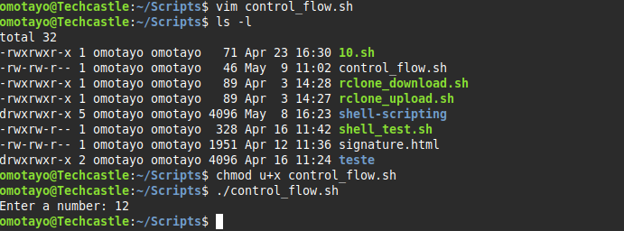
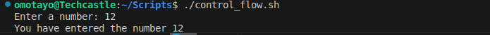
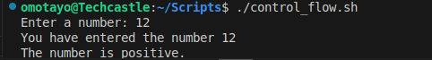
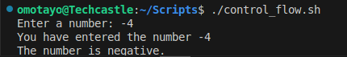

# Control_flow

## Creating the control_flow.sh file and executing it

## Executing the read command 

## Executing the if command

## Executing the ifelse command
       

## Executing the forloop command

### Executing in cstyle form
